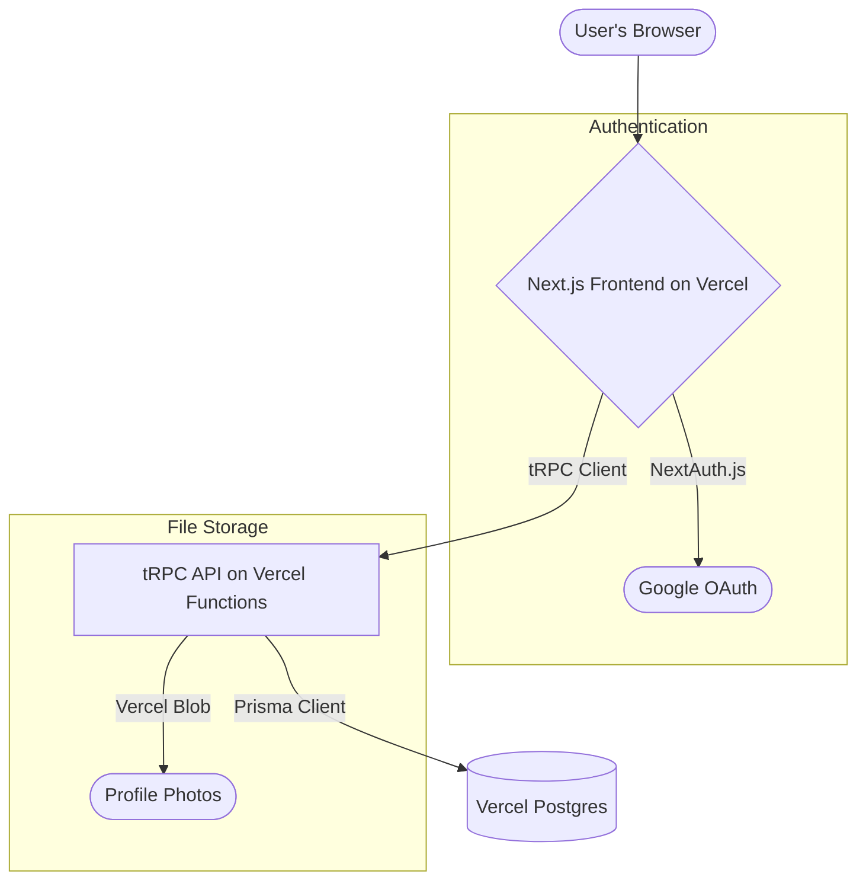

# Full-Stack Architecture Document: Family Quests

## 1. Introduction
This document outlines the complete fullstack architecture for **Family Quests**, including backend systems, frontend implementation, and their integration. It serves as the single source of truth for development, ensuring consistency across the entire technology stack.

### Starter Template or Existing Project
The project is a greenfield application built on **Next.js** and **PostgreSQL**. Per our discussion, the architecture will be based on the principles of the **"T3 Stack" (Next.js, TypeScript, Tailwind CSS, tRPC, Prisma, NextAuth.js)** to ensure a modern, type-safe, and highly productive development environment.

### Change Log
| Date | Version | Description | Author |
| :--- | :--- | :--- | :--- |
| 2025-09-01 | 1.0 | Initial architecture draft | Winston (Architect) |

---
## 2. High-Level Architecture
### Technical Summary
"Family Quests" will be a modern, full-stack, type-safe web application deployed on the Vercel platform. The architecture is serverless by default, leveraging Vercel Functions for the API layer via tRPC. The frontend is a reactive Next.js application, communicating with a Vercel Postgres database via the Prisma ORM. Authentication is handled by NextAuth.js, providing a secure and simple integration with Google. This stack is designed for rapid development, scalability, and an excellent developer experience.

### High-Level Architecture Diagram


### Architectural Patterns
* **Monorepo:** Using npm workspaces to manage shared code (e.g., types) between the frontend and backend, ensuring consistency.
* **Serverless:** The API is built with serverless functions, which scale automatically and reduce infrastructure management overhead.
* **End-to-End Type Safety:** Using tRPC and Prisma, we ensure that types are shared from the database schema all the way to the frontend components, eliminating an entire class of common bugs.
* **Component-Based UI:** The frontend will be built with reusable React components, following the patterns laid out in the UI/UX Specification.

---
## 3. Tech Stack
| Category | Technology | Version | Purpose |
| :--- | :--- | :--- | :--- |
| **Framework** | Next.js | 14.x | Full-stack React framework for UI and API. |
| **Language** | TypeScript | 5.x | Enforces type safety across the entire project. |
| **Styling** | Tailwind CSS | 3.x | Utility-first CSS framework for rapid UI development. |
| **API** | tRPC | 11.x | Provides end-to-end typesafe APIs. |
| **Database ORM** | Prisma | 5.x | Next-generation ORM for Node.js and TypeScript. |
| **Database** | Vercel Postgres | - | Serverless PostgreSQL database. |
| **Authentication** | NextAuth.js | 5.x | Handles secure user authentication. |
| **Deployment** | Vercel | - | Hosting platform for Next.js applications. |
| **File Storage** | Vercel Blob | - | For storing user-uploaded profile photos. |
| **Testing** | Vitest & RTL | latest | For unit and integration testing. |

---
## 4. Database Schema (Prisma)
This schema defines our database structure. It will live in `packages/db/schema.prisma`.
```prisma
// This is your Prisma schema file,
// learn more about it in the docs: https://pris.ly/d/prisma-schema

generator client {
  provider = "prisma-client-js"
}

datasource db {
  provider = "postgresql"
  url      = env("DATABASE_URL")
}

model Family {
  id        String   @id @default(cuid())
  name      String
  createdAt DateTime @default(now())
  updatedAt DateTime @updatedAt
  members   User[]
  quests    Quest[]
  rewards   Reward[]
}

model User {
  id            String    @id @default(cuid())
  name          String?
  email         String?   @unique
  emailVerified DateTime?
  image         String? // Profile photo URL from Vercel Blob
  role          UserRole  @default(CHILD)
  points        Int       @default(0)
  familyId      String?
  family        Family?   @relation(fields: [familyId], references: [id])
  accounts      Account[]
  sessions      Session[]
}

enum UserRole {
  PARENT
  CHILD
}

model Quest {
  id          String   @id @default(cuid())
  title       String
  points      Int      @default(1)
  icon        String?
  frequency   String   // e.g., 'daily', 'weekly', 'once'
  familyId    String
  family      Family   @relation(fields: [familyId], references: [id])
  assignments QuestAssignment[]
  completions QuestCompletion[]
}

model QuestAssignment {
  id      String @id @default(cuid())
  questId String
  quest   Quest  @relation(fields: [questId], references: [id])
  userId  String
  user    User   @relation(fields: [userId], references: [id])

  @@unique([questId, userId])
}

model QuestCompletion {
  id        String   @id @default(cuid())
  questId   String
  quest     Quest    @relation(fields: [questId], references: [id])
  userId    String
  user      User     @relation(fields: [userId], references: [id])
  completedAt DateTime @default(now())
  approvedAt  DateTime?
  status    String   // 'pending', 'approved', 'rejected'
}

model Reward {
  id          String   @id @default(cuid())
  title       String
  description String?
  pointsCost  Int
  familyId    String
  family      Family   @relation(fields: [familyId], references: [id])
  redemptions RewardRedemption[]
}

model RewardRedemption {
  id        String   @id @default(cuid())
  rewardId  String
  reward    Reward   @relation(fields: [rewardId], references: [id])
  userId    String
  user      User     @relation(fields: [userId], references: [id])
  redeemedAt DateTime @default(now())
  fulfilledAt DateTime?
}


// Models for NextAuth.js
model Account {
  id                String  @id @default(cuid())
  userId            String
  type              String
  provider          String
  providerAccountId String
  refresh_token     String? @db.Text
  access_token      String? @db.Text
  expires_at        Int?
  token_type        String?
  scope             String?
  id_token          String? @db.Text
  session_state     String?
  user              User    @relation(fields: [userId], references: [id], onDelete: Cascade)

  @@unique([provider, providerAccountId])
}

model Session {
  id           String   @id @default(cuid())
  sessionToken String   @unique
  userId       String
  expires      DateTime
  user         User     @relation(fields: [userId], references: [id], onDelete: Cascade)
}

model VerificationToken {
  identifier String
  token      String   @unique
  expires    DateTime

  @@unique([identifier, token])
}
```

---
## 5. API Specification (tRPC)
The API will be defined as a set of tRPC routers. This provides end-to-end type safety.
```typescript
// Located in: apps/web/src/server/api/root.ts
import { questRouter } from "./routers/quest";
import { createTRPCRouter } from "./trpc";

export const appRouter = createTRPCRouter({
  quest: questRouter,
  // familyRouter,
  // rewardRouter,
  // authRouter,
});

export type AppRouter = typeof appRouter;

// Example Quest Router: apps/web/src/server/api/routers/quest.ts
export const questRouter = createTRPCRouter({
  create: protectedProcedure
    .input(z.object({ title: z.string(), points: z.number() /* ... */ }))
    .mutation(async ({ ctx, input }) => {
      // ... logic to create a quest
    }),
  
  approve: protectedProcedure
    .input(z.object({ completionId: z.string() }))
    .mutation(async ({ ctx, input }) => {
      // ... logic to approve a quest and award points
    }),
  // ... other procedures like list, complete, etc.
});
```
---
## 6. Unified Project Structure
The project will be a monorepo managed with npm workspaces.
```plaintext
/family-quests
├── apps
│   └── web/          # Next.js application (UI and API)
│       ├── src/
│       │   ├── app/      # App Router pages and layouts
│       │   ├── components/ # Shared React components
│       │   ├── lib/      # Helper functions, utils
│       │   └── server/   # tRPC API implementation
│       │       ├── api/
│       │       └── db.ts   # Prisma client instance
│       ├── public/
│       └── next.config.js
├── packages
│   ├── db/           # Prisma schema and generated client
│   │   └── schema.prisma
│   └── ui/           # (Optional) Shared UI component library
└── package.json      # Root package.json with workspaces
```
---
## 7. Deployment Architecture
* **Platform**: Vercel.
* **Process**: Deployment is handled automatically via a Git push to the main branch. Vercel will build the Next.js application, deploy the serverless tRPC API, and connect to the Vercel Postgres database and Vercel Blob storage.
* **Environments**:
    * **Production**: `main` branch.
    * **Staging**: Preview deployments are automatically created for every pull request.

---
## 8. Security
* **Authentication**: Handled by NextAuth.js with the Google Provider. Sessions are managed with secure, HTTP-only cookies.
* **Authorization**: API procedures will be protected using tRPC middleware to ensure a user belongs to the correct family before allowing any data access or mutation.
* **Database**: Access is managed through Prisma, which prevents SQL injection attacks.
* **Child Login**: The permalink for child login must be a long, cryptographically secure, unguessable string.

---
## 9. Next Steps
*(This section will be populated by the Product Owner to guide the development sprints.)*