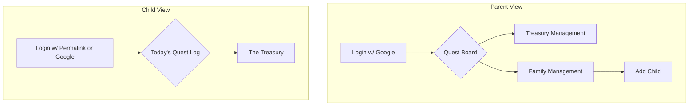
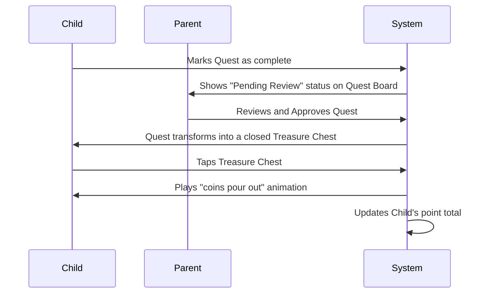

Please let me know when you are ready to proceed with the handoff to the Architect.

Markdown

# UI/UX Specification: Family Quests

## 1. Introduction
This document defines the user experience goals, information architecture, user flows, and visual design specifications for **Family Quests**. [cite_start]It serves as the foundation for visual design and frontend development, ensuring a cohesive and user-centered experience. [cite: 667, 668]

### Overall UX Goals & Principles
#### Target User Personas
* **The Adventurer (Child, 4+):** Motivated by fun, discovery, and reward. [cite_start]Needs a highly visual, simple, and forgiving interface that celebrates their accomplishments. [cite: 672]
* **The Quest Master (Parent):** Busy and goal-oriented. [cite_start]Needs an efficient, clear, and fast interface for managing quests and rewards without it feeling like another chore. [cite: 672]

#### Usability Goals
* [cite_start]**Learnability:** A 4-year-old should be able to understand their main dashboard and how to complete a quest with minimal instruction. [cite: 673]
* [cite_start]**Efficiency:** A parent should be able to add a week's worth of recurring quests in under 5 minutes. [cite: 674]
* **Engagement:** The app should feel like a delightful game, encouraging children to return daily.

#### Design Principles
1.  [cite_start]**Adventure in Every Interaction:** Every tap and animation should reinforce the fun, adventurous theme. [cite: 675]
2.  **Clarity for the Child:** Prioritize simple icons and clear visual feedback over text. [cite_start]Never make the child feel lost or confused. [cite: 675]
3.  [cite_start]**Efficiency for the Parent:** The parent's interface must be clean, fast, and respectful of their time. [cite: 675]
4.  [cite_start]**Celebrate Accomplishment:** Generously reward task completion with positive, delightful feedback. [cite: 676]

#### Thematic Micro-interactions
* **Quest Approval:** Approved quests appear as tappable treasure chests that animate points into the user's total.
* **New Quest:** New daily quests can appear as rolled-up scrolls that unfurl on tap.
* **Reward Redemption:** Redeemed rewards can "poof" from a virtual store shelf with a magical effect.

---
## 2. Information Architecture (IA)
### Site Map

### Navigation Structure
* **Parent:** A simple tab bar or bottom navigation on mobile with three primary items: "Quest Board," "Treasury," and "Family."
* **Child:** A minimalist single-screen experience. The "Treasury" is accessed via a prominent button on the main "Today's Quest Log" screen.

---
## 3. User Flows
### Core Flow: Quest Completion & Reward Collection

* **Edge Case:** If a Parent "Rejects" a quest, it should return to the child's "Today's Quest Log" with a simple, non-negative indicator (e.g., a note from the parent).

---
## 4. Wireframes & Mockups
* **Primary Design Files:** High-fidelity mockups and prototypes will be created and maintained in **Figma**.
* **Key Screen Layouts (Conceptual):**
    * **Child "Today's Quest Log":** A vertical, scrollable view. Each quest is a large, colorful card or "scroll" with a huge icon. A "magic meter" at the top visually represents the current point total. Completed and approved quests are shown as animated treasure chests at the top of the list, waiting to be opened.
    * **Parent "Quest Board":** A clean, minimalist list view. Each row represents a quest and shows its name, assignment, and point value. Tapping a row expands it "inline" to edit details. A prominent "Add New Quest" input is always visible at the top for rapid entry.

---
## 5. Component Library / Design System
* **Design System Approach:** A custom, lightweight design system will be created to ensure consistency with the "Family Quests" theme.
* **Core Components:**
    * `QuestCard` (Child View): Displays quest icon, name. States: `New`, `PendingReview`, `TreasureToCollect`.
    * `EditableQuestItem` (Parent View): A list item that displays quest info and expands to an editable form.
    * `RewardItem` (Shared View): Card displaying a reward's image, name, and point cost.
    * `ProfileAvatar`: Circular component for user profile photos.
    * `PointsCounter`: Animated numerical display for the points total.

---
## 6. Branding & Style Guide
* **Color Palette:**
    * **Primary:** A vibrant, adventurous teal (`#1ABC9C`).
    * **Secondary:** A warm, parchment-like beige (`#F3E5AB`).
    * **Accent/Magic:** A shimmering gold for rewards (`#FFD700`) and a magical purple for effects (`#8E44AD`).
    * **UI:** Standard success green, warning orange, and error red, plus neutral grays for text.
* **Typography:**
    * **Headings:** A rounded, playful sans-serif font (e.g., Poppins, Nunito).
    * **Body:** A clean, highly readable sans-serif (e.g., Inter, Lato).
* **Iconography:** A friendly, filled-icon style will be used. A library like "Phosphor Icons" is recommended as a base, with custom icons created for key concepts (quests, treasury, etc.).
* **Spacing:** A 4px or 8px grid system for consistent spacing and layout.

---
## 7. Accessibility & Responsiveness
* **Compliance Target:** WCAG 2.1 AA. Key requirements include high-contrast text, large tap targets, and basic screen reader support.
* **Breakpoints:**
    * **Mobile:** Up to 767px
    * **Tablet:** 768px - 1023px
    * **Desktop:** 1024px+
* **Adaptation:** The design is mobile-first. The parent's "Quest Board" may transform into a multi-column layout on desktop for better oversight.

---
## 8. Animation & Micro-interactions
* **Motion Principles:** Motion should be rewarding, provide clear feedback, and enhance the magical theme without being distracting or slow.
* **Key Animations:**
    * The "Treasure Chest" opening sequence.
    * The "Scroll Unfurling" for new quests.
    * A "poof" effect for redeemed rewards.
    * A shimmer/fill effect on the points bar.